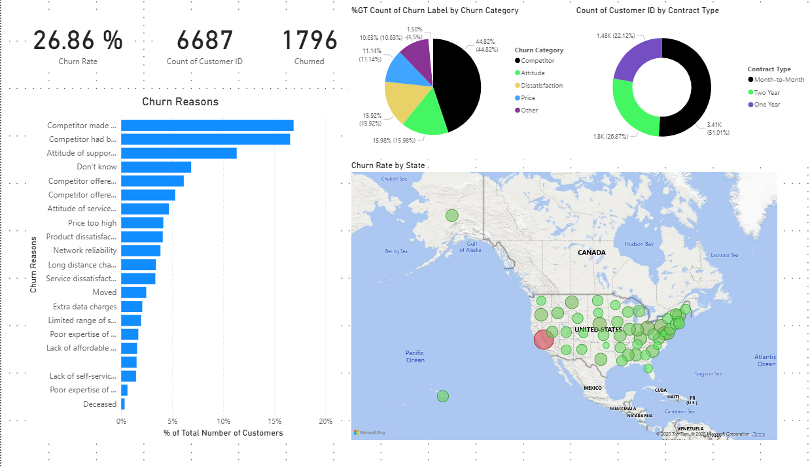
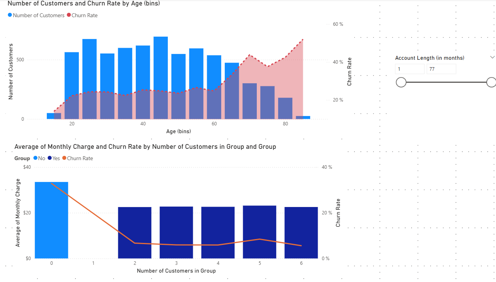
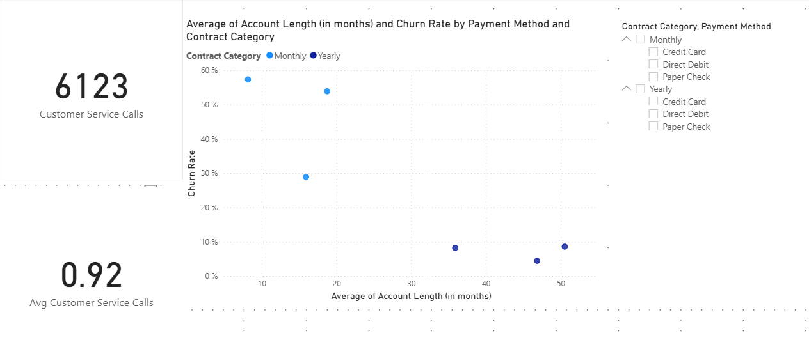
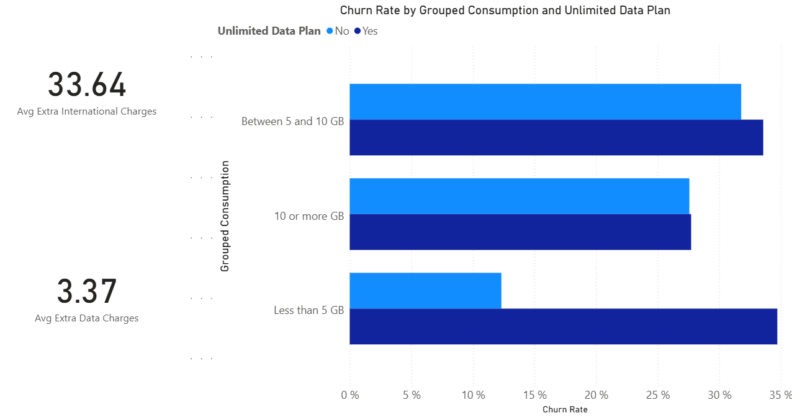

# Databel Customer Churn Analysis

## Problem Overview
Databel, a telecom provider, faced a significant customer churn issue. The company wanted to understand the key drivers behind customer attrition and identify actionable insights to reduce churn rates.  
This analysis was conducted using a **fictitious churn dataset** from Databel, containing **29 columns** and one row per customer. Each record represented a snapshot in time (no time-series data). The primary objective was to explore, analyze, and visualize customer churn patterns across demographics, contracts, and usage behaviors using **Power BI dashboards**.

## Analysis
<a href="https://github.com/lois2inn/Dashboards/blob/main/Customer%20Churn%20Analysis/CustomerChurnAnalysisReport.pdf">Customer Churn Report</a>  

The dataset was first **checked for duplicates** in `Customer_ID` to ensure data integrity. The **Churn Label** column (Yes/No) identified whether a customer had left the company.  

Key analyses performed:  
- **Overall Churn Rate:** 26.86%  
- **Churn Reasons:** 50% of churned customers left for competitors.
  
  
- **Demographics:**  
  - Customers were categorized into **age bins**.  
  - **Senior customers (38.46%)** showed the highest churn rate.
    
     
- **Geographical Analysis:**  
  - **California** showed an **abnormally high churn rate of 63.24%**.  
- **Plan and Contract Insights:**  
  - Customers on **group plans** paid lower monthly charges and churned less.  
  - **Unlimited plans** had higher churn rates compared to month-to-month contracts.  
  - **Churn rate decreases** with longer contract terms — from 1-month to 2-year plans.
    
- **Usage and Service Analysis:**  
  - In California, **72% of churned customers** had an **international plan** they did not use.
    
    
- **Payment Method:**  
  - **Direct Debit** was the most common payment method, followed by **credit card** and **paper check** customers.

All findings were summarized in **two interactive dashboards**: one for churn overview and another for customer profile analysis.

## Conclusions
The analysis revealed that customer churn is not evenly distributed across all customer segments. Specific factors such as **geography (California)**, **plan type (unlimited)**, and **customer demographics (seniors)** contributed significantly to churn.  
Customers with **longer contract commitments** were less likely to leave, suggesting that **contract length** plays a stabilizing role. Additionally, **underused premium services** (e.g., international plans) may lead to dissatisfaction and eventual churn.

## Recommendations
Based on the findings, the following actions are recommended for Databel Telecom:  
1. **Targeted Retention Campaigns:** Focus on **California** and **senior customers**, who show the highest churn rates.  
2. **Review Unlimited and International Plans:** Simplify or reprice unused services to align with customer needs.  
3. **Promote Long-Term Contracts:** Offer incentives for customers to switch from **month-to-month** to **1-year or 2-year** plans.  
4. **Group Plan Incentives:** Encourage customers to join group or family plans since they show lower churn and higher satisfaction.  
5. **Customer Feedback Loop:** Implement surveys to capture reasons behind competitor-driven churn (50% rate).  
6. **Monitor Payment Channels:** Evaluate payment experience for non–Direct Debit users to reduce friction.  
